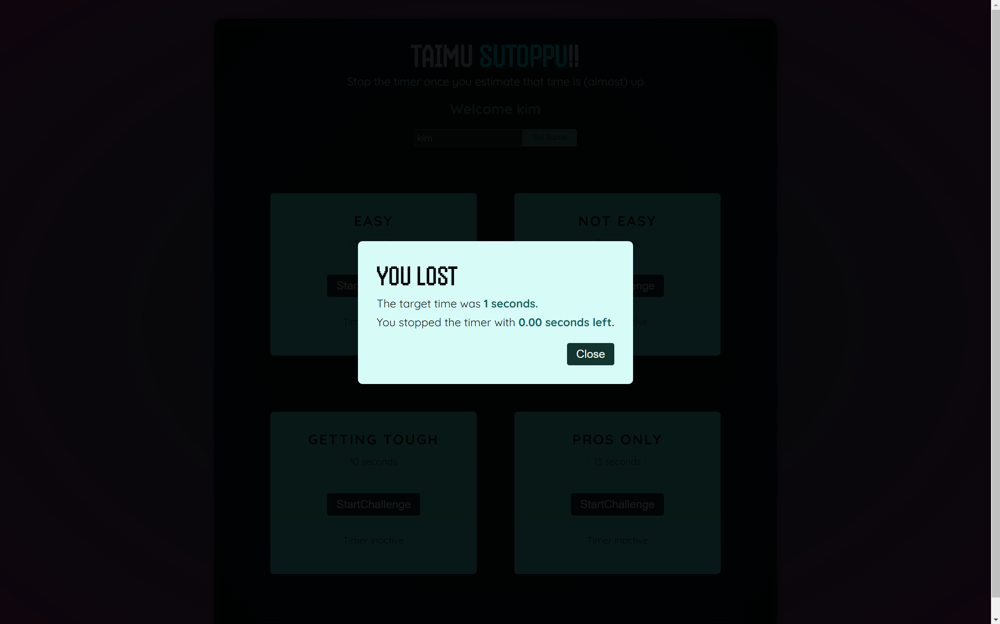

# react-study-repo

#### Explore the world of React with hands-on exercises and projects in this dedicated learning repository. Level up your React skills and build real-world applications!
---
## 0. react-essentials

: 리액트의 핵심

---

## 1. tic-tac-toe

: [틱택토 정보](https://ko.wikipedia.org/wiki/%ED%8B%B1%ED%83%9D%ED%86%A0)

|  |  |
| -------------------------------------------------------- | -------------------------------------------------------- |
|        |          |

---

## 2. taimu-sutoppu

: 시간 맞추기

|  |  |
| -------------------------------------------------------- | -------------------------------------------------------- |
|        |          |
